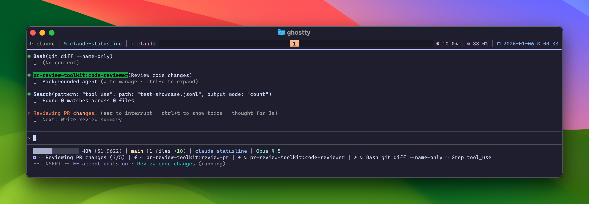

# Claude Code Statusline

A real-time statusline plugin for [Claude Code](https://claude.ai/claude-code) that displays tool activity, agent status, and todo progress.



## Features

- **Context Window**: Visual progress bar showing token usage
- **Session Cost**: Running cost of the current session
- **Git Status**: Current branch with file counts and line changes
- **Tool Activity**: Real-time display of running and completed tools
- **Agent Status**: Track spawned agents (Explore, code-reviewer, etc.) with elapsed time
- **Skill Tracking**: Show which skill Claude is currently using (brainstorming, TDD, etc.)
- **Todo Progress**: Current task and completion status (done/total)

## Preview

```
██████░░░░░░░░░ 42% ($0.0234) | main (3 files +45 -12) | my-project | Claude Opus 4
 ⟳ Fix auth bug (2/5) |  ✓ brainstorming |  ✓ Explore (3s) |  ✓ Glob ✓ Read ⟳ Edit
```

**Line 1** (Bash): Context bar, cost, git status, directory, model
**Line 2** (Rust): Todos, skills, agents, tools

## Requirements

- **macOS** (Apple Silicon)
- **Rust** (for building the binary)
- **jq** (for JSON parsing)
- **Claude Code** CLI

## Installation

### Quick Install

```bash
git clone https://github.com/YOUR_USERNAME/claude-statusline.git
cd claude-statusline
./install.sh
```

### Manual Install

1. **Build the Rust binary:**
   ```bash
   cargo build --release
   ```

2. **Copy files to Claude directory:**
   ```bash
   mkdir -p ~/.claude/bin
   cp target/release/claude-status ~/.claude/bin/
   cp statusline.sh ~/.claude/
   chmod +x ~/.claude/bin/claude-status ~/.claude/statusline.sh
   ```

3. **Configure Claude Code** by adding to `~/.claude/settings.json`:
   ```json
   {
     "statusLine": {
       "type": "command",
       "command": "~/.claude/statusline.sh",
       "padding": 0
     }
   }
   ```

4. **Restart Claude Code** to see the statusline.

## Uninstallation

```bash
./uninstall.sh
```

Or manually:
```bash
rm ~/.claude/bin/claude-status
rm ~/.claude/statusline.sh
# Remove "statusLine" from ~/.claude/settings.json
```

## Configuration

### Color Scheme

The plugin uses the [Catppuccin Mocha](https://github.com/catppuccin/catppuccin) color palette:

| Element | Color | Hex |
|---------|-------|-----|
| Section icons (, , ) | Lavender | `#b4befe` |
| Complete (✓) | Green | `#a6e3a1` |
| Running (⟳) | Yellow | `#f9e2af` |
| Error (✗) | Red | `#f38ba8` |
| Separators | Gray | Standard terminal gray |

### Nerd Fonts

This plugin uses [Nerd Font](https://www.nerdfonts.com/) icons. Make sure your terminal uses a Nerd Font for proper icon rendering:

- `` - Checkbox (todos)
- `` - Lightning bolt (skills)
- `` - Robot (agents)
- `` - Wrench (tools)
- `` - Spinner (running)
- `` - Check (complete)
- `` - X (error)

**Recommended fonts:** JetBrainsMono Nerd Font, FiraCode Nerd Font, Hack Nerd Font

## Architecture

```
~/.claude/
├── statusline.sh          # Bash orchestrator
│   ├── Line 1: Context, cost, git, directory, model (via jq)
│   └── Line 2: Calls claude-status binary
├── bin/
│   └── claude-status      # Rust binary (transcript parser)
└── settings.json          # Claude Code configuration
```

### How It Works

1. **Claude Code** calls `statusline.sh` periodically, passing JSON via stdin with model info, cost, and context window data.

2. **statusline.sh** (Bash):
   - Parses stdin JSON for Line 1 data
   - Gets git status from the current directory
   - Calls the Rust binary with the transcript path

3. **claude-status** (Rust):
   - Parses the JSONL transcript file
   - Tracks tool_use/tool_result pairs
   - Tracks Task (agent) invocations
   - Tracks TodoWrite updates
   - Outputs formatted Line 2

### Transcript Parsing

The Rust binary implements event sourcing over the Claude Code transcript:

| Event | Action |
|-------|--------|
| `tool_use` | Add to running tools map |
| `tool_result` | Move to completed, increment count |
| `Task` tool_use | Create agent entry |
| `Task` tool_result | Mark agent complete |
| `Skill` tool_use | Create/update skill entry (deduplicated by name) |
| `Skill` tool_result | Mark skill complete |
| `TodoWrite` | Update todo state |
| `user` message (top-level) | Mark pending reset |
| `assistant` message (top-level) | Reset tools/agents for new turn |

**Per-turn tracking**: Tools, agents, and skills reset when you send a new message and Claude starts responding, so you only see the current turn's activity.

## Troubleshooting

### Icons not displaying
- Ensure your terminal uses a Nerd Font
- Test with: `echo -e "\uf110 \uf00c \uf00d"` (should show spinner, check, x)

### Statusline not appearing
1. Check Claude Code settings: `cat ~/.claude/settings.json | jq .statusLine`
2. Verify files exist: `ls -la ~/.claude/statusline.sh ~/.claude/bin/claude-status`
3. Test manually: `echo '{}' | ~/.claude/statusline.sh`

### Tools/agents disappearing
- This is expected! Activity resets at the start of each turn
- Tools persist until you send a new message and Claude responds

### Build errors
- Ensure Rust is installed: `cargo --version`
- Try: `rustup update`

## Development

### Build from source
```bash
cargo build --release
```

### Run tests
```bash
cargo test
```

### Debug output
```bash
~/.claude/bin/claude-status /path/to/transcript.jsonl
```

## Contributing

Contributions are welcome! Please feel free to submit a Pull Request.

## License

MIT License - see [LICENSE](LICENSE) for details.

## Acknowledgments

- Inspired by [claude-hud](https://github.com/jarrodwatts/claude-hud)
- Color scheme: [Catppuccin](https://github.com/catppuccin/catppuccin)
- Icons: [Nerd Fonts](https://www.nerdfonts.com/)
